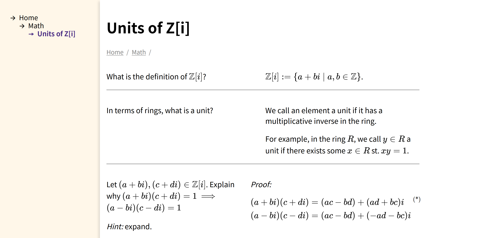

# Epsilon-Delta Notes

Made for college students, a tool for organizing your notes.



This software is in active development. The dependencies are listed in [dependencies.md](dependencies.md); you can generate a test DB by running:

```
./test/import_test_data.py
```

and run an experimental instance with:

```
./epsilon-delta-notes test/test.db -c settings.sample
```

## Problem statement

- Paper based notes are not searchable. You can't change/expand paper notes you have taken a long time ago.
- Popular applications for organizing notes lack math support. To typeset formulas, one has to hand-write them or install additional plugins to their applications.
- Knowledge is organized into trees and graphs, but few note-taking apps leverage such concepts.
- The markup language is either too simple for math studying, or too overwhelming to learn.
- In Real Analysis, proofs do not necessarily reflect the writer's thought process. We cannot insert unrelated words into the proofs, but we need a way to communicate the thought process that is lost in translation.

## Comparative analysis

- Evernote does not have a tree structure and does not support math equations.
- Zim/CherryTree have trees, but do not support math.
- MediaWiki is a server-side wiki program. It runs with a web server and the required effort of configuration seems out of place in a note-taking scenario.
- MoinMoin has a "desktop mode" but it does not use "free linking" -- it does not display the link as a full page title; rather, it shows the programmer-readable page ID.
- CLiki does not use, in the developers' own words, "StudlyCaps", which is "good" for our purposes, but it does not have a tree view. I'm not sure about its math support.

## How

- A wiki that supports math equations. There is no easy way to render Math equations in Qt (I don't want to write differential equations in MathML) so I resorted to KaTeX (a javascript LaTeX rendering library made by Khan Academy)
- A wiki that is easy to configure and run despite being web based -- use flask, SQLite3 and optionally uwsgi
- A wiki that uses an SQLite3 db file as the notebook. The database is capable of storing and indexing the metadata of each article in a tree. It also has logarithmic run-time complexity. We can still have plain text as an import/export format
- A dual-column layout that can document the though process on one side, and answers on the other side
- A sidebar showing the tree structure
- A button to generate (editable) table of contents
- A @toc command that displays the "default" table of content
- Some kind of version keeping

## Other considerations

- Use the Linux package manager to get dependencies (flask, katex, font-awesome)
- Make the current program state visible (e.g. "Editing page x, not saved")
- Use Racket "scribble" markup syntax? (language is extensible, and has better escaping for LaTeX input)

## Buzzword

The notetaking tool for galaxy brainers.
